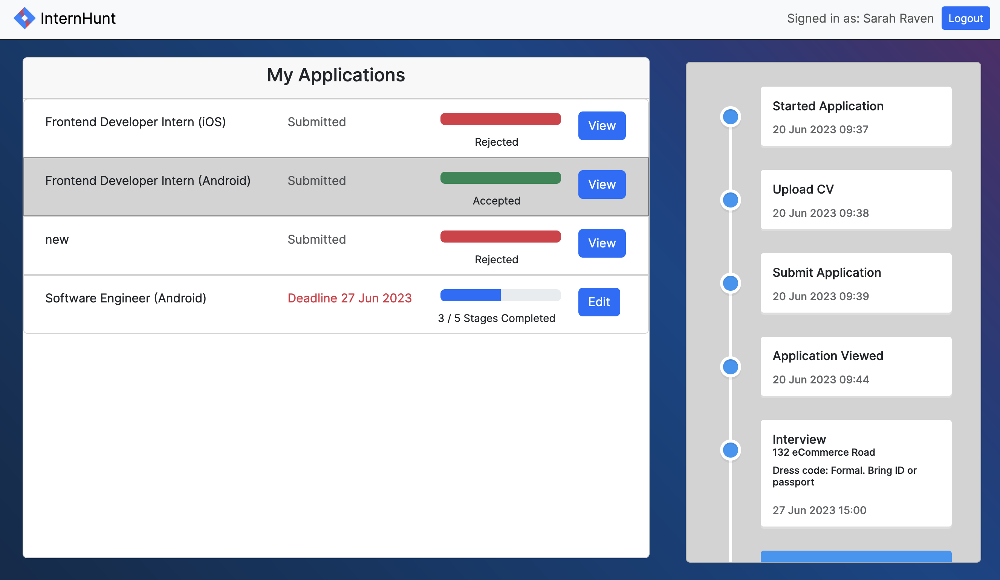

This is a [Next.js](https://nextjs.org/) project providing students with better feedback on their internship applications. Developed as part of a group at Imperial College London 

## Getting Started

After cloning the repo, run `npm install` or `yarn install` or `pnpm install`. Then run the development server:

```bash
npm run dev
# or
yarn dev
# or
pnpm dev
```

Open [http://localhost:3000](http://localhost:3000) with your browser to see the result.

## Screenshots


